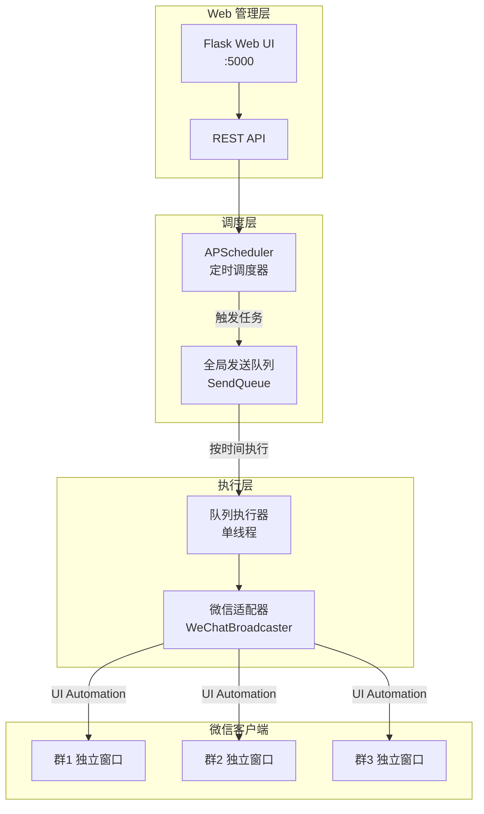
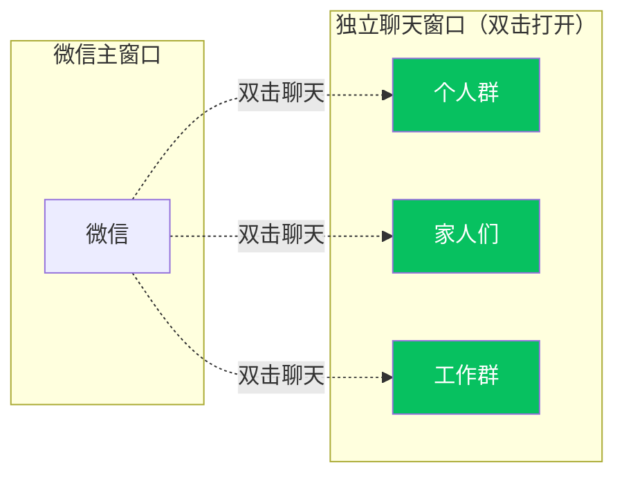
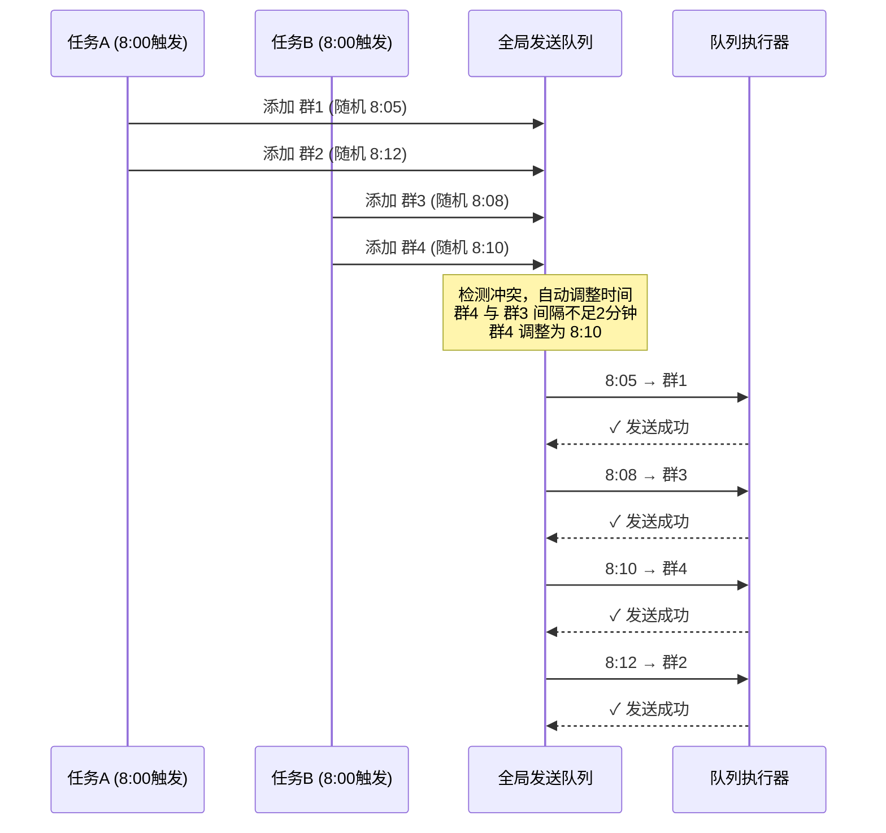
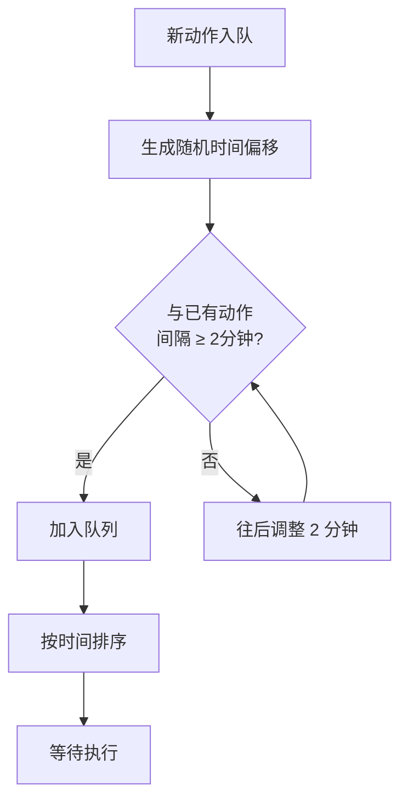
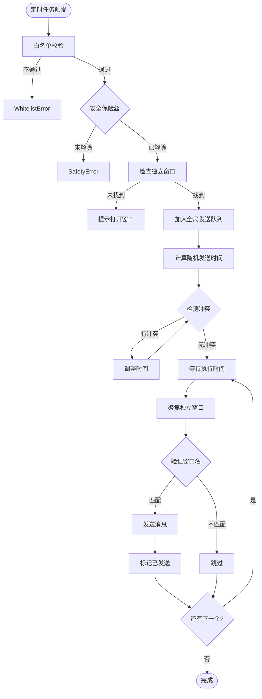
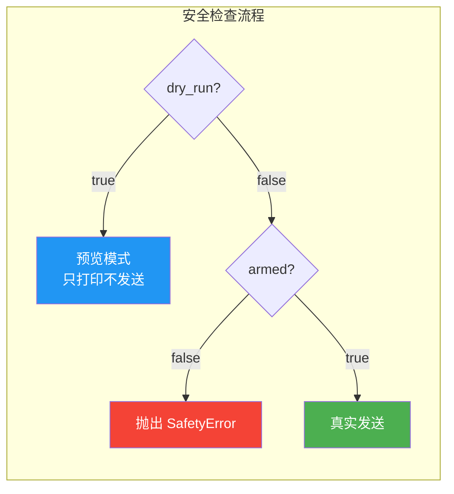
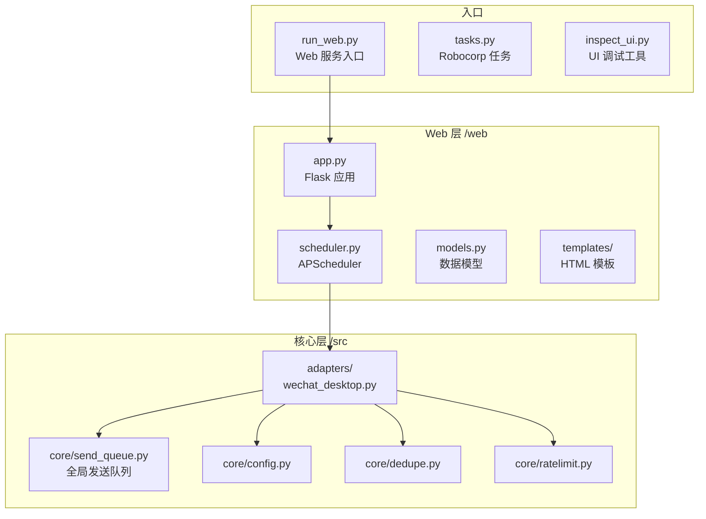
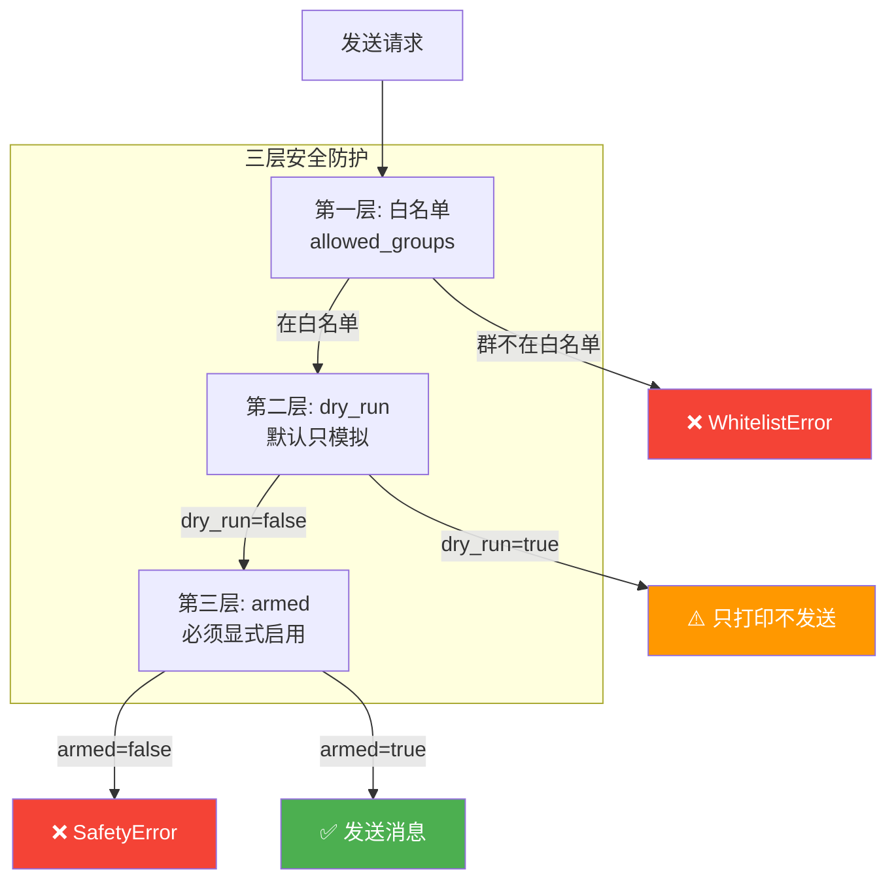

# WeChat Broadcast Automation Hub

基于独立窗口检测的 Windows 微信桌面客户端**无人值守**白名单群发工具。

> ⚠️ **声明**：本工具仅供学习和内部自动化使用。请遵守微信使用规范，避免滥用导致账号风控。

## ✨ 功能特性

- ✅ **独立窗口模式**：通过 UI Automation 精确定位独立聊天窗口，可靠性高
- ✅ **闭环验证**：发送前验证窗口名称，确保发到正确的群
- ✅ **全局发送队列**：所有任务统一排队，自动避免冲突
- ✅ **Web 管理界面**：可视化配置定时任务，实时查看发送队列
- ✅ **定时群发**：支持每天/每周/每月等多种调度规则
- ✅ **随机时间窗口**：在指定时间窗口内随机分布发送
- ✅ **白名单群发**：仅向配置的白名单群发送消息
- ✅ **图文消息**：支持同时发送图片和文字
- ✅ **去重机制**：基于时间间隔，同一群在指定时间内不会重复发送
- ✅ **限频保护**：滑动窗口限流，默认每分钟最多 10 条
- ✅ **自动重试**：指数退避 + 随机抖动，失败自动重试 3 次
- ✅ **安全保险丝**：双重保护（`armed` + `dry_run`），防止误操作

---

## 🏗️ 系统架构



---

## 🚀 快速开始

### 一键安装

```powershell
# 1. 安装依赖
install.bat

# 2. 启动服务
start_web.bat

# 3. 浏览器访问
http://localhost:5000
```

### ⚠️ 使用前提（重要）

**本工具使用「独立窗口模式」**，运行前需要手动打开目标群的独立聊天窗口：



1. 在微信中**双击**要群发的聊天，使其变成独立窗口
2. 建议将独立窗口**置顶**，防止被其他窗口遮挡
3. 保持独立窗口打开状态，然后运行任务

---

## 🖥️ Web 管理界面

### 启动服务

```powershell
# 方式1：双击运行
start_web.bat

# 方式2：命令行
python run_web.py
```

### 访问地址

| 访问方式 | 地址 |
|---------|------|
| 本地访问 | http://localhost:5000 |
| 远程访问 | http://你的IP:5000 |

### 功能页面

| 页面 | 路径 | 功能 |
|------|------|------|
| 任务管理 | `/` | 创建、编辑、删除定时任务 |
| 发送队列 | `/queue` | 实时查看待发送和已发送的动作 |
| 执行日志 | `/logs` | 查看历史执行记录 |

### 调度规则示例

| 需求 | 调度规则 |
|------|----------|
| 每天晚上 8 点 | `daily 20:00` |
| 每周六中午 12 点 | `weekly 6 12:00` |
| 每月 1 日早上 9 点 | `monthly 1 09:00` |
| 每周三、五、六 20:00 | `0 20 * * 3,5,6` |
| 标准 Cron | `0 20 * * *` |

> **周几对应**：0=周日, 1=周一, 2=周二, 3=周三, 4=周四, 5=周五, 6=周六

---

## 📊 发送队列机制

所有任务的发送动作统一进入全局队列，自动避免冲突：



### 防碰撞逻辑



### 配置参数

```json
{
  "wechat": {
    "random_delay_minutes": 30,
    "min_delay_between_groups_sec": 120
  }
}
```

| 参数 | 说明 | 默认值 |
|------|------|--------|
| `random_delay_minutes` | 时间窗口（分钟），0=立即发送 | 0 |
| `min_delay_between_groups_sec` | 动作间最小间隔（秒） | 120 |

**效果示例**：定时 `8:00`，窗口30分钟，最小间隔2分钟，发送5个群：

```mermaid
gantt
    title 发送时间分布（8:00 - 8:30 窗口）
    dateFormat HH:mm
    axisFormat %H:%M
    
    section 群发送
    群1 :done, 08:03, 1m
    群2 :done, 08:08, 1m
    群3 :done, 08:14, 1m
    群4 :done, 08:21, 1m
    群5 :done, 08:27, 1m
```



所有群在 8:30 之前完成发送，且相互间隔至少 2 分钟。

---

## 🔄 发送流程



---

## ⚙️ 配置说明

### config.json 示例

```json
{
  "wechat": {
    "per_message_delay_sec": 2.0,
    "max_per_minute": 10,
    "min_send_interval_sec": 60,
    "screenshot_on_error": true,
    "random_delay_minutes": 30,
    "min_delay_between_groups_sec": 120
  },
  "safety": {
    "armed": false,
    "dry_run": true
  },
  "allowed_groups": [
    "个人群",
    "家人们",
    "工作群"
  ]
}
```

### 参数说明

| 参数 | 说明 | 默认值 |
|------|------|--------|
| `per_message_delay_sec` | 无随机延迟时的消息间隔（秒） | 2.0 |
| `max_per_minute` | 每分钟最大发送数 | 10 |
| `min_send_interval_sec` | 同一群最小发送间隔（秒） | 60 |
| `screenshot_on_error` | 失败时截图 | true |
| `random_delay_minutes` | 时间窗口（分钟，0=立即） | 0 |
| `min_delay_between_groups_sec` | 动作间最小间隔（秒） | 120 |
| `armed` | 安全保险丝 | false |
| `dry_run` | 试运行模式 | true |

### 安全模式



| 模式 | `dry_run` | `armed` | 行为 |
|------|-----------|---------|------|
| **预览模式**（默认） | `true` | `false` | 只打印，不发送 |
| **禁止发送** | `false` | `false` | 抛出安全异常 |
| **真实发送** | `false` | `true` | 实际发送消息 |

---

## 📁 项目结构



```
chat-automation-hub/
├── install.bat              # 一键安装脚本
├── start_web.bat            # 一键启动脚本
├── run_web.py               # Web 服务入口
├── tasks.py                 # Robocorp 任务入口
├── inspect_ui.py            # UI Inspector 调试工具
├── config.json              # 配置文件
├── requirements.txt         # Python 依赖
│
├── web/                     # Web 管理界面
│   ├── app.py               # Flask 应用
│   ├── models.py            # 数据模型
│   ├── scheduler.py         # APScheduler 调度
│   └── templates/           # HTML 模板
│       ├── base.html
│       ├── index.html       # 任务管理
│       ├── queue.html       # 发送队列
│       └── logs.html        # 执行日志
│
├── src/                     # 核心代码
│   ├── core/                # 核心模块
│   │   ├── config.py        # 配置加载
│   │   ├── send_queue.py    # 全局发送队列
│   │   ├── dedupe.py        # 去重
│   │   ├── ratelimit.py     # 限频
│   │   ├── retry.py         # 重试
│   │   └── log.py           # 日志
│   └── adapters/
│       └── wechat_desktop.py  # 微信适配器
│
├── assets/uploads/          # 上传的图片
└── output/                  # 运行输出
    ├── state.db             # 去重状态
    ├── scheduler.db         # 任务数据
    └── wechat_error_*.png   # 错误截图
```

---

## 🔍 调试工具

### UI Inspector

检查 Windows UI 元素，帮助调试：

```powershell
python inspect_ui.py        # 交互模式
python inspect_ui.py -m     # 鼠标追踪模式
python inspect_ui.py -l     # 列出所有窗口
```

### 独立窗口测试

```powershell
python test_independent_windows.py --list   # 列出独立窗口
python test_independent_windows.py --dry    # 模拟发送
python test_independent_windows.py --send   # 真实发送
```

---

## 🔧 命令行操作

### 重启项目

```powershell
# 一键重启
Get-Process python* -ErrorAction SilentlyContinue | Stop-Process -Force; python run_web.py
```

### 运行任务

```powershell
# 预览模式
python -m robocorp.tasks run tasks.py -t wechat_broadcast

# 真实发送（需修改 config.json）
# armed=true, dry_run=false
python -m robocorp.tasks run tasks.py -t wechat_broadcast
```

---

## ⚠️ 常见问题

### 1. 「未找到独立窗口」

- 确保已在微信中**双击聊天**打开独立窗口
- 窗口名必须与 `allowed_groups` 中的群名一致

### 2. 发送到错误的群

- 检查群名是否唯一
- 避免群名过于简短或相似

### 3. 锁屏导致失败

- 运行时保持屏幕解锁
- 禁用自动锁屏

### 4. 风控建议

- `max_per_minute` 设为 5-10
- `min_delay_between_groups_sec` 设为 120+
- 使用随机时间窗口分散发送

### 5. 500 Internal Server Error

```powershell
# 停止所有 Python 进程后重启
Get-Process python* -ErrorAction SilentlyContinue | Stop-Process -Force
python run_web.py
```

---

## 🔒 安全机制



---

## 📜 许可证

MIT License

---

## 🙏 致谢

- [uiautomation](https://github.com/yinkaisheng/Python-UIAutomation-for-Windows) - Windows UI 自动化
- [Robocorp](https://robocorp.com/) - Python RPA 框架
- [Flask](https://flask.palletsprojects.com/) - Web 框架
- [APScheduler](https://apscheduler.readthedocs.io/) - 定时调度
