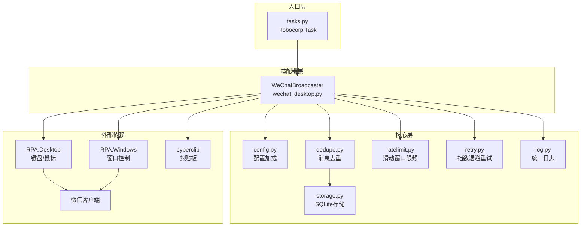
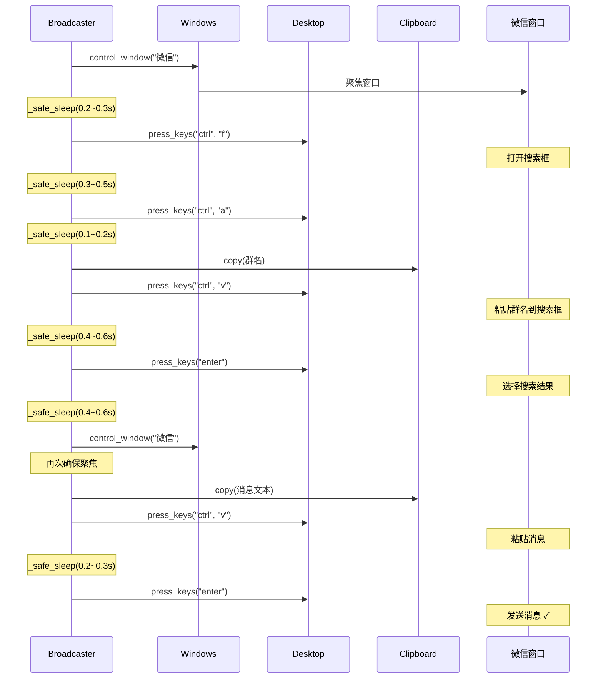
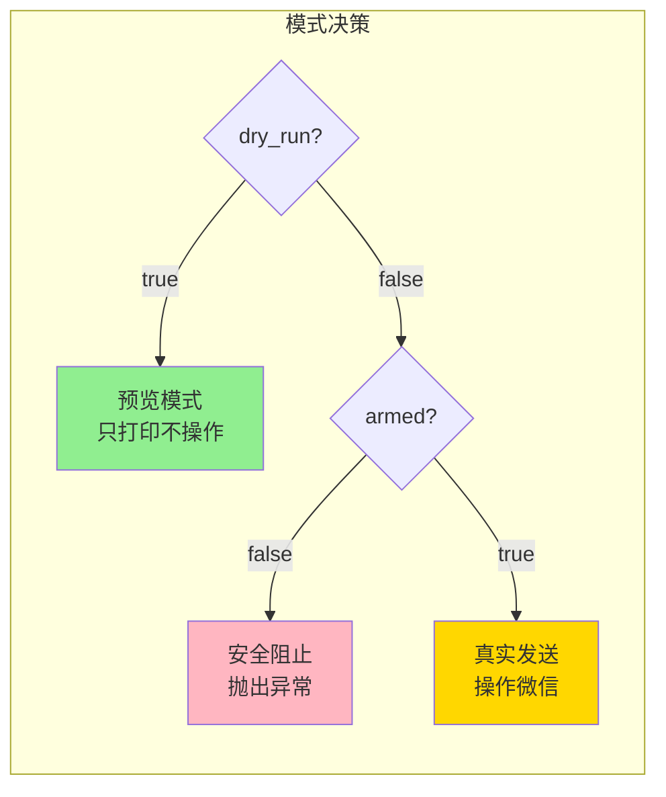
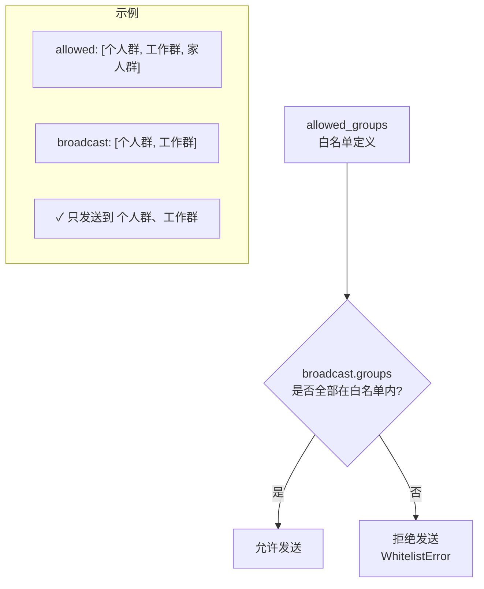
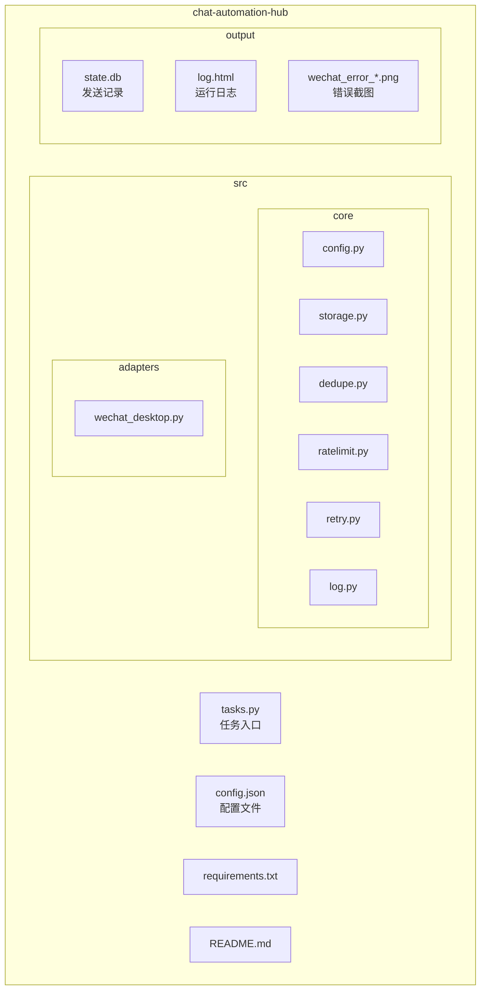
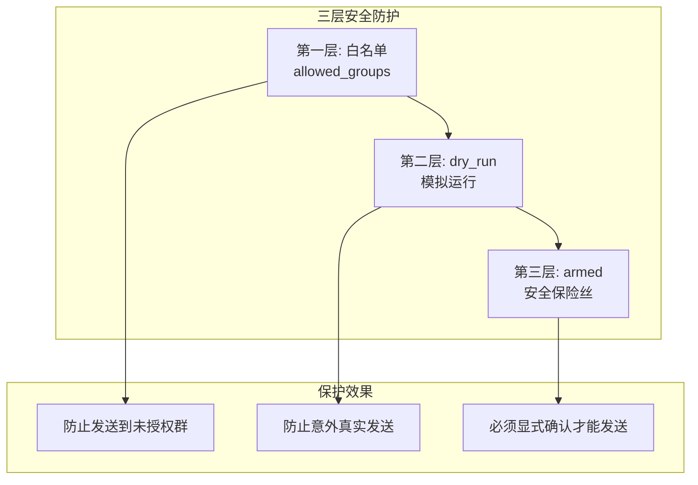

# WeChat Broadcast Automation Hub

基于 Robocorp + RPA Framework 的 Windows 微信桌面客户端**无人值守**白名单群发工具。

> ⚠️ **声明**：本工具仅供学习和内部自动化使用。请遵守微信使用规范，避免滥用导致账号风控。

## ✨ 功能特性

- ✅ **白名单群发**：仅向配置的白名单群发送消息
- ✅ **去重机制**：相同群+相同内容不会重复发送（基于 SHA256）
- ✅ **限频保护**：滑动窗口限流，默认每分钟最多 10 条
- ✅ **自动重试**：指数退避 + 随机抖动，失败自动重试 3 次
- ✅ **失败截图**：发送失败时自动截图保存到 `output/` 目录
- ✅ **安全保险丝**：双重保护（`armed` + `dry_run`），防止误操作

---

## 🏗️ 系统架构



---

## 🔄 广播流程

```mermaid
flowchart TD
    START([开始]) --> LOAD[加载配置<br/>config.json]
    LOAD --> RENDER[渲染消息模板<br/>替换 {ts}]
    RENDER --> WHITELIST{白名单校验}
    
    WHITELIST -->|不通过| ERROR1[抛出 WhitelistError]
    WHITELIST -->|通过| SAFETY{安全保险丝检查<br/>dry_run=false?<br/>armed=true?}
    
    SAFETY -->|未解除| ERROR2[抛出 SafetyError]
    SAFETY -->|已解除/dry_run| READY[确保微信窗口就绪]
    
    READY -->|失败| ERROR3[抛出 RuntimeError]
    READY -->|成功| LOOP[遍历目标群列表]
    
    LOOP --> DEDUPE{去重检查<br/>已发送过?}
    DEDUPE -->|是| SKIP[跳过<br/>skipped++]
    DEDUPE -->|否| RATE[限频等待<br/>滑动窗口]
    
    RATE --> SEND[发送消息<br/>带 @retry 重试]
    SEND -->|成功| MARK[标记已发送<br/>写入 state.db]
    SEND -->|失败| SCREENSHOT[截图保存<br/>failed++]
    
    MARK --> SENT[sent++]
    
    SKIP --> NEXT{还有下一个群?}
    SENT --> NEXT
    SCREENSHOT --> RECOVER[恢复窗口状态] --> NEXT
    
    NEXT -->|是| DELAY[延迟等待] --> LOOP
    NEXT -->|否| DONE([完成<br/>返回统计])
    
    ERROR1 --> END([结束])
    ERROR2 --> END
    ERROR3 --> END
```

---

## 📤 单条消息发送流程



---

## 📦 安装

### 1. 环境要求

- Windows 10/11
- Python 3.10+
- 微信 PC 版（已登录）

### 2. 安装依赖

```powershell
# 克隆或进入项目目录
cd chat-automation-hub

# 安装依赖
pip install -r requirements.txt
```

### 3. 配置

编辑 `config.json`：

```json
{
  "wechat": {
    "exe_path": "C:\\Program Files (x86)\\Tencent\\WeChat\\WeChat.exe",
    "window_title_regex": "微信",
    "per_message_delay_sec": 2.0,
    "max_per_minute": 10,
    "screenshot_on_error": true
  },
  "safety": {
    "armed": false,
    "dry_run": true,
    "confirm": false
  },
  "allowed_groups": [
    "个人群",
    "测试群"
  ],
  "broadcast": {
    "groups": ["个人群"],
    "text": "【通知】当前时间: {ts}\n这是一条自动消息。"
  }
}
```

---

## 🚀 运行

### 基本命令

```powershell
python -m robocorp.tasks run tasks.py -t wechat_broadcast
```

### 运行模式



| 模式 | `dry_run` | `armed` | 行为 |
|------|-----------|---------|------|
| **预览模式**（默认） | `true` | `false` | 只打印将要发送的内容，不操作微信 |
| **禁止发送** | `false` | `false` | 抛出安全异常，阻止执行 |
| **真实发送** | `false` | `true` | 实际操作微信发送消息 |

### 参数说明

#### `dry_run`（试运行）

- `true`：模拟运行，打印发送计划，**不会操作微信**
- `false`：尝试真实发送

#### `armed`（安全保险丝）

- `false`（默认）：保险丝锁定，即使 `dry_run=false` 也会阻止发送
- `true`：解除保险丝，允许真实发送

> 💡 **设计理念**：必须同时设置 `dry_run=false` 和 `armed=true` 才能真实发送，防止误操作。

---

## 📋 白名单策略

### 工作原理



### 示例

```json
{
  "allowed_groups": ["个人群", "工作群A", "工作群B", "测试群"],
  "broadcast": {
    "groups": ["工作群A", "工作群B"],
    "text": "周报提醒"
  }
}
```

上例只会发送到 `工作群A` 和 `工作群B`，即使 `个人群` 在白名单中也不会收到。

### 安全保障

- ❌ 如果 `broadcast.groups` 包含不在白名单中的群，任务会立即失败
- ❌ 无法通过修改 `broadcast.groups` 发送到白名单之外的群

---

## ⚠️ 常见问题与避坑指南

### 1. 锁屏导致发送失败

**问题**：Windows 锁屏后 UI 自动化无法操作窗口。

**解决**：
- 运行任务时保持屏幕解锁
- 使用远程桌面时不要关闭窗口（最小化可以）
- 禁用自动锁屏：`设置 → 账户 → 登录选项 → 从不`

### 2. 屏幕缩放导致定位偏移

**问题**：Windows 缩放非 100%（如 125%、150%）可能导致控件定位失败。

**解决**：
- 将显示缩放设置为 **100%**
- 或者调整微信窗口大小确保控件可见

### 3. 微信窗口焦点丢失

**问题**：其他窗口弹出抢占焦点，导致快捷键发送到错误窗口。

**解决**：
- 关闭不必要的通知（Windows、微信通知）
- 本工具每次操作前会自动重新聚焦窗口
- 尽量在独立的干净环境运行

### 4. 微信版本更新导致快捷键失效

**问题**：微信更新后 `Ctrl+F` 或其他快捷键可能变化。

**解决**：
- 手动测试 `Ctrl+F` 是否仍能打开搜索
- 如有变化，修改 `wechat_desktop.py` 中的快捷键
- 关注微信更新日志

### 5. 风控与限频建议

**问题**：频繁发送可能触发微信风控（限制发消息、临时封号）。

**建议**：
- `max_per_minute` 设为 5-10（不要太高）
- `per_message_delay_sec` 设为 2-5 秒
- 避免短时间内大量群发
- 内容不要包含敏感词、链接
- 不同时间段发送不同内容（利用 `{ts}` 变量）

### 6. 群名搜索不精确

**问题**：搜索群名时可能匹配到多个结果，导致发送到错误的群。

**解决**：
- 使用**完整且唯一**的群名
- 避免群名过于简短或与其他群重名
- 测试时先用 `dry_run=true` 确认

### 7. 中文输入法干扰

**问题**：系统输入法可能干扰剪贴板粘贴。

**解决**：
- 本工具使用剪贴板 + `Ctrl+V` 输入，避免直接打字
- 如仍有问题，切换到英文输入法后运行

---

## 📁 项目结构



### 目录说明

| 路径 | 说明 |
|------|------|
| `tasks.py` | Robocorp 任务入口 |
| `config.json` | 配置文件 |
| `src/core/` | 核心模块（配置、存储、去重、限频、重试、日志） |
| `src/adapters/` | 适配器（微信桌面客户端） |
| `output/` | 运行时输出（数据库、日志、截图） |

---

## 🔧 高级用法

### 自定义消息模板

`text` 支持 `{ts}` 变量，会被替换为当前时间：

```json
{
  "text": "【{ts}】系统巡检正常，本消息由自动化工具发送。"
}
```

输出示例：`【2026-01-03 10:30:00】系统巡检正常，本消息由自动化工具发送。`

### 清除发送记录（重新发送）

去重记录存储在 `output/state.db`，删除即可重置：

```powershell
Remove-Item output\state.db
```

### 运行自测

验证 core 模块是否正常：

```powershell
python -m robocorp.tasks run tasks.py -t self_test_core
```

---

## 🔒 安全机制总览



---

## 📜 许可证

MIT License

---

## 🙏 致谢

- [Robocorp](https://robocorp.com/) - Python RPA 框架
- [RPA Framework](https://rpaframework.org/) - 自动化库
