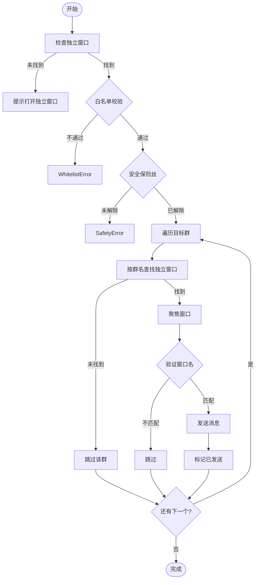

# WeChat Broadcast Automation Hub

基于独立窗口检测的 Windows 微信桌面客户端**无人值守**白名单群发工具。

> ⚠️ **声明**：本工具仅供学习和内部自动化使用。请遵守微信使用规范，避免滥用导致账号风控。

## ✨ 功能特性

- ✅ **独立窗口模式**：通过 UI Automation 精确定位独立聊天窗口，可靠性高
- ✅ **闭环验证**：发送前验证窗口名称，确保发到正确的群
- ✅ **Web 管理界面**：可视化配置定时任务，支持远程访问
- ✅ **定时群发**：支持每天/每周/每月等多种调度规则
- ✅ **白名单群发**：仅向配置的白名单群发送消息
- ✅ **图文消息**：支持同时发送图片和文字
- ✅ **去重机制**：基于时间间隔，同一群在指定时间内不会重复发送
- ✅ **限频保护**：滑动窗口限流，默认每分钟最多 10 条
- ✅ **自动重试**：指数退避 + 随机抖动，失败自动重试 3 次
- ✅ **失败截图**：发送失败时自动截图保存
- ✅ **安全保险丝**：双重保护（`armed` + `dry_run`），防止误操作

---

## 🚀 快速开始

### 一键安装

```powershell
# 1. 双击运行 install.bat 安装依赖
install.bat

# 2. 双击运行 start_web.bat 启动服务
start_web.bat

# 3. 浏览器访问
http://localhost:5000
```

### ⚠️ 使用前提（重要）

**本工具使用「独立窗口模式」**，运行前需要手动打开目标群的独立聊天窗口：

1. 在微信中**双击**要群发的聊天，使其变成独立窗口
2. 建议将独立窗口**置顶**，防止被其他窗口遮挡
3. 保持独立窗口打开状态，然后运行任务

```
┌─────────────┐    ┌─────────────┐    ┌─────────────┐
│   个人群    │    │   家人们    │    │   工作群    │
│  (独立窗口)  │    │  (独立窗口)  │    │  (独立窗口)  │
└─────────────┘    └─────────────┘    └─────────────┘
       ↑                 ↑                  ↑
       └─────────────────┴──────────────────┘
                   程序自动检测并发送
```

---

## 🖥️ Web 管理界面

### 启动服务

```powershell
# 方式1：双击运行
start_web.bat

# 方式2：命令行
python run_web.py
```

### 访问地址

| 访问方式 | 地址 |
|---------|------|
| 本地访问 | http://localhost:5000 |
| 远程访问 | http://你的IP:5000 |

### 调度规则示例

| 需求 | 调度规则 |
|------|----------|
| 每天晚上 8 点 | `daily 20:00` |
| 每周六中午 12 点 | `weekly 6 12:00` |
| 每月 1 日早上 9 点 | `monthly 1 09:00` |
| 标准 Cron | `0 20 * * *` |

---

## 🔄 工作流程



---

## ⚙️ 配置说明

### config.json 示例

```json
{
  "wechat": {
    "per_message_delay_sec": 2.0,
    "max_per_minute": 10,
    "min_send_interval_sec": 60,
    "screenshot_on_error": true
  },
  "safety": {
    "armed": false,
    "dry_run": true
  },
  "allowed_groups": [
    "个人群",
    "家人们",
    "工作群"
  ],
  "broadcast": {
    "groups": ["个人群", "家人们"],
    "text": "【通知】当前时间: {ts}\n这是一条自动消息。",
    "image": "assets/test_image.png"
  }
}
```

### 参数说明

| 参数 | 说明 | 默认值 |
|------|------|--------|
| `per_message_delay_sec` | 每条消息间隔（秒） | 2.0 |
| `max_per_minute` | 每分钟最大发送数 | 10 |
| `min_send_interval_sec` | 同一群最小发送间隔（秒） | 60 |
| `screenshot_on_error` | 失败时截图 | true |
| `armed` | 安全保险丝 | false |
| `dry_run` | 试运行模式 | true |
| `allowed_groups` | 白名单群组列表 | [] |

### 安全模式

| 模式 | `dry_run` | `armed` | 行为 |
|------|-----------|---------|------|
| **预览模式**（默认） | `true` | `false` | 只打印，不发送 |
| **禁止发送** | `false` | `false` | 抛出安全异常 |
| **真实发送** | `false` | `true` | 实际发送消息 |

---

## 📁 项目结构

```
chat-automation-hub/
├── install.bat              # 一键安装脚本
├── start_web.bat            # 一键启动脚本
├── run_web.py               # Web 服务入口
├── tasks.py                 # Robocorp 任务入口
├── inspect_ui.py            # UI Inspector 调试工具
├── test_independent_windows.py  # 独立窗口测试工具
├── config.json              # 配置文件
├── requirements.txt         # Python 依赖
│
├── web/                     # Web 管理界面
│   ├── app.py
│   ├── models.py
│   ├── scheduler.py
│   └── templates/
│
├── src/                     # 核心代码
│   ├── core/                # 核心模块
│   │   ├── config.py
│   │   ├── storage.py
│   │   ├── dedupe.py
│   │   ├── ratelimit.py
│   │   ├── retry.py
│   │   └── log.py
│   └── adapters/
│       └── wechat_desktop.py  # 微信适配器（独立窗口版）
│
├── assets/                  # 资源文件
│   └── uploads/
│
└── output/                  # 运行输出
    ├── state.db
    ├── scheduler.db
    └── wechat_error_*.png
```

---

## 🔍 调试工具

### UI Inspector

检查 Windows UI 元素，帮助调试：

```powershell
python inspect_ui.py        # 交互模式
python inspect_ui.py -m     # 鼠标追踪模式
python inspect_ui.py -l     # 列出所有窗口
```

### 独立窗口测试

测试独立窗口检测和发送：

```powershell
python test_independent_windows.py --list   # 列出独立窗口
python test_independent_windows.py --dry    # 模拟发送
python test_independent_windows.py --send   # 真实发送
```

---

## ⚠️ 常见问题

### 1. 「未找到独立窗口」

- 确保已在微信中**双击聊天**打开独立窗口
- 窗口名必须与 `allowed_groups` 中的群名一致

### 2. 发送到错误的群

- 检查群名是否唯一
- 避免群名过于简短或相似

### 3. 锁屏导致失败

- 运行时保持屏幕解锁
- 禁用自动锁屏

### 4. 风控建议

- `max_per_minute` 设为 5-10
- `per_message_delay_sec` 设为 2-5 秒
- 避免短时间大量群发

### 5. 500 Internal Server Error

```powershell
# 停止所有 Python 进程后重启
Get-Process python* -ErrorAction SilentlyContinue | Stop-Process -Force
python run_web.py
```

---

## 🔧 命令行使用

### 重启项目

```powershell
# 一键重启（停止所有 Python 进程并重新启动）
Get-Process python* -ErrorAction SilentlyContinue | Stop-Process -Force; python run_web.py
```

### 运行任务

```powershell
# 预览模式（不实际发送）
python -m robocorp.tasks run tasks.py -t wechat_broadcast

# 真实发送（需修改 config.json: armed=true, dry_run=false）
python -m robocorp.tasks run tasks.py -t wechat_broadcast

# 运行自测
python -m robocorp.tasks run tasks.py -t self_test_core
```

---

## 🔒 安全机制

```
┌─────────────────────────────────────────────────────┐
│              三层安全防护                            │
├─────────────────────────────────────────────────────┤
│  第一层: 白名单 (allowed_groups)                     │
│    → 只能发送到预设的群                              │
├─────────────────────────────────────────────────────┤
│  第二层: dry_run 模式                               │
│    → 默认只模拟，不真正发送                          │
├─────────────────────────────────────────────────────┤
│  第三层: armed 保险丝                               │
│    → 必须显式设为 true 才能发送                      │
└─────────────────────────────────────────────────────┘
```

---

## 📜 许可证

MIT License

---

## 🙏 致谢

- [uiautomation](https://github.com/yinkaisheng/Python-UIAutomation-for-Windows) - Windows UI 自动化
- [Robocorp](https://robocorp.com/) - Python RPA 框架
- [Flask](https://flask.palletsprojects.com/) - Web 框架
- [APScheduler](https://apscheduler.readthedocs.io/) - 定时调度
