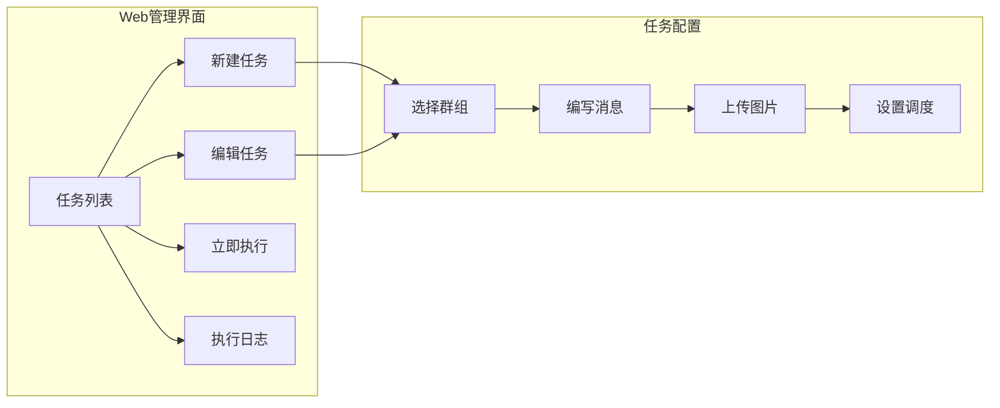
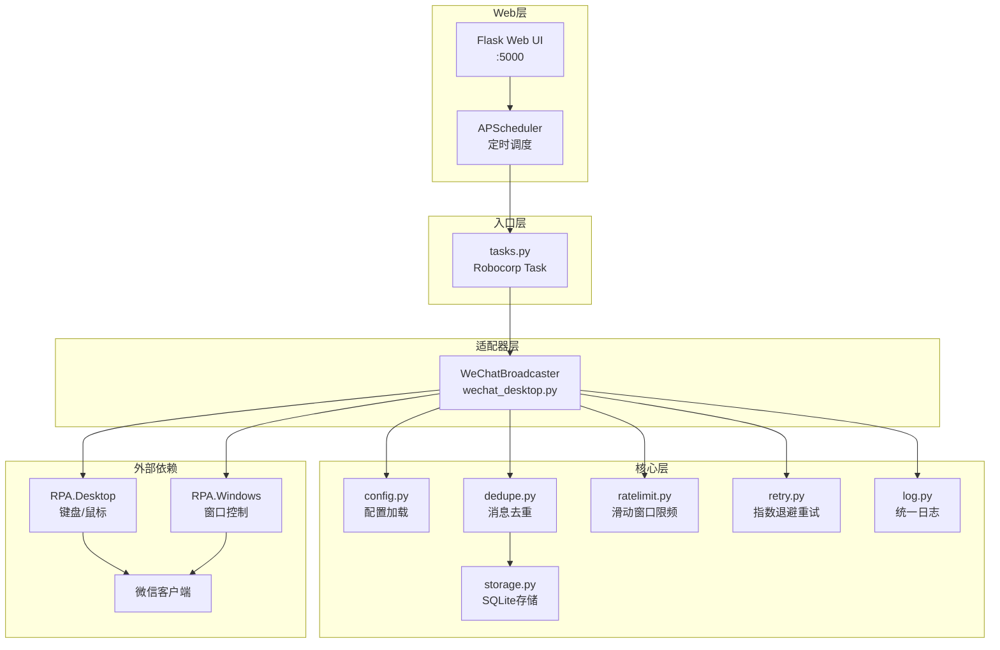
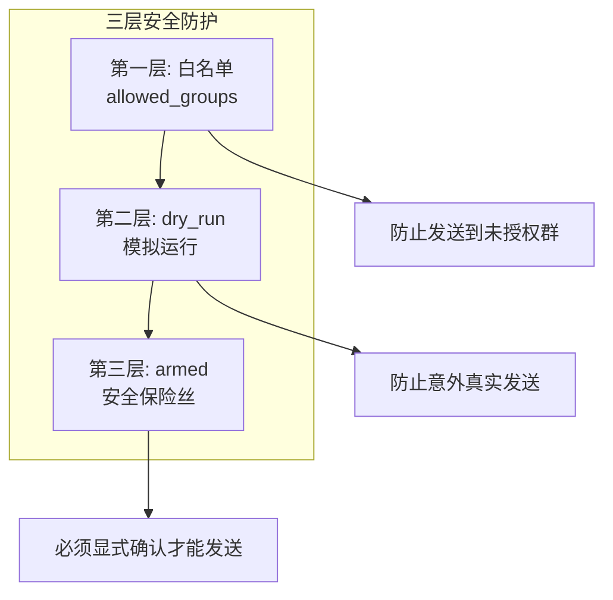

# WeChat Broadcast Automation Hub

基于 Robocorp + RPA Framework 的 Windows 微信桌面客户端**无人值守**白名单群发工具。

> ⚠️ **声明**：本工具仅供学习和内部自动化使用。请遵守微信使用规范，避免滥用导致账号风控。

## ✨ 功能特性

- ✅ **Web 管理界面**：可视化配置定时任务，支持远程访问
- ✅ **定时群发**：支持每天/每周/每月等多种调度规则
- ✅ **白名单群发**：仅向配置的白名单群发送消息
- ✅ **图文消息**：支持同时发送图片和文字
- ✅ **去重机制**：基于时间间隔，同一群在指定时间内不会重复发送（默认 60 秒）
- ✅ **限频保护**：滑动窗口限流，默认每分钟最多 10 条
- ✅ **自动重试**：指数退避 + 随机抖动，失败自动重试 3 次
- ✅ **失败截图**：发送失败时自动截图保存
- ✅ **安全保险丝**：双重保护（`armed` + `dry_run`），防止误操作

---

## 🚀 快速开始

### 一键安装（推荐）

```powershell
# 1. 双击运行 install.bat 安装依赖
install.bat

# 2. 双击运行 start_web.bat 启动服务
start_web.bat

# 3. 浏览器访问
http://localhost:5000
```

### 手动安装

```powershell
# 安装依赖
pip install -r requirements.txt

# 启动 Web 管理界面
python run_web.py
```

---

## 🖥️ Web 管理界面

### 启动服务

```powershell
# 方式1：双击运行
start_web.bat

# 方式2：PowerShell 命令
Get-Process python3.13 -ErrorAction SilentlyContinue | Stop-Process -Force; python run_web.py
```

### 访问地址

| 访问方式 | 地址 |
|---------|------|
| 本地访问 | http://localhost:5000 |
| 远程访问 | http://你的IP:5000 |

### 功能说明



### 调度规则示例

| 需求 | 调度规则 |
|------|----------|
| 每天晚上 8 点 | `daily 20:00` |
| 每周六中午 12 点 | `weekly 6 12:00` |
| 每月 1 日早上 9 点 | `monthly 1 09:00` |
| 标准 Cron（每天 20:00） | `0 20 * * *` |

> 周几说明：0=周日，1=周一，2=周二，...，6=周六

---

## 📦 部署到其他电脑

### 方式一：复制工程（推荐）

#### 步骤 1：复制文件

将以下文件/文件夹复制到目标电脑：

```
chat-automation-hub/
├── install.bat          ← 一键安装脚本
├── start_web.bat        ← 一键启动脚本
├── start_web.ps1
├── run_web.py
├── tasks.py
├── config.json          ← 需要修改白名单
├── requirements.txt
├── src/                 ← 整个目录
├── web/                 ← 整个目录
└── assets/              ← 整个目录
```

**不需要复制**：`output/`、`__pycache__/`、`.git/`

#### 步骤 2：目标电脑要求

- Windows 10/11
- Python 3.10+（[下载地址](https://www.python.org/downloads/)）
- 微信 PC 版（已登录）

#### 步骤 3：一键安装

双击运行 **`install.bat`**

#### 步骤 4：配置白名单

编辑 `config.json`，修改 `allowed_groups` 为目标电脑微信中的群名：

```json
{
  "allowed_groups": [
    "你的群名1",
    "你的群名2"
  ]
}
```

#### 步骤 5：启动服务

双击运行 **`start_web.bat`**

---

## 🏗️ 系统架构



---

## 🔄 广播流程

```mermaid
flowchart TD
    START([开始]) --> LOAD[加载配置]
    LOAD --> RENDER[渲染消息模板<br/>替换 {ts}]
    RENDER --> WHITELIST{白名单校验}
    
    WHITELIST -->|不通过| ERROR1[抛出 WhitelistError]
    WHITELIST -->|通过| SAFETY{安全保险丝检查}
    
    SAFETY -->|未解除| ERROR2[抛出 SafetyError]
    SAFETY -->|已解除| READY[确保微信窗口就绪]
    
    READY -->|失败| ERROR3[抛出 RuntimeError]
    READY -->|成功| LOOP[遍历目标群列表]
    
    LOOP --> DEDUPE{去重检查<br/>基于时间间隔}
    DEDUPE -->|间隔内| SKIP[跳过]
    DEDUPE -->|可发送| RATE[限频等待]
    
    RATE --> SEND[发送消息<br/>带重试]
    SEND -->|成功| MARK[标记已发送]
    SEND -->|失败| SCREENSHOT[截图保存]
    
    SKIP --> NEXT{还有下一个群?}
    MARK --> NEXT
    SCREENSHOT --> NEXT
    
    NEXT -->|是| DELAY[延迟等待] --> LOOP
    NEXT -->|否| DONE([完成])
```

---

## ⚙️ 配置说明

### config.json 完整示例

```json
{
  "wechat": {
    "exe_path": "C:\\Program Files (x86)\\Tencent\\WeChat\\WeChat.exe",
    "window_title_regex": "微信",
    "per_message_delay_sec": 2.0,
    "max_per_minute": 10,
    "min_send_interval_sec": 60,
    "screenshot_on_error": true
  },
  "safety": {
    "armed": false,
    "dry_run": true,
    "confirm": false
  },
  "allowed_groups": [
    "个人群",
    "测试群",
    "工作群"
  ],
  "broadcast": {
    "groups": ["个人群"],
    "text": "【通知】当前时间: {ts}\n这是一条自动消息。",
    "image": "assets/test_image.png"
  }
}
```

### 参数说明

| 参数 | 说明 | 默认值 |
|------|------|--------|
| `wechat.exe_path` | 微信安装路径 | 默认路径 |
| `wechat.per_message_delay_sec` | 每条消息间隔（秒） | 2.0 |
| `wechat.max_per_minute` | 每分钟最大发送数 | 10 |
| `wechat.min_send_interval_sec` | 同一群最小发送间隔（秒） | 60 |
| `safety.armed` | 安全保险丝 | false |
| `safety.dry_run` | 试运行模式 | true |
| `allowed_groups` | 白名单群组列表 | [] |

### 安全模式

| 模式 | `dry_run` | `armed` | 行为 |
|------|-----------|---------|------|
| **预览模式**（默认） | `true` | `false` | 只打印，不操作微信 |
| **禁止发送** | `false` | `false` | 抛出安全异常 |
| **真实发送** | `false` | `true` | 实际发送消息 |

---

## 📁 项目结构

```
chat-automation-hub/
├── install.bat              # 一键安装脚本
├── start_web.bat            # 一键启动脚本
├── start_web.ps1            # PowerShell 启动脚本
├── run_web.py               # Web 服务入口
├── tasks.py                 # Robocorp 任务入口
├── inspect_ui.py            # UI Inspector 调试工具
├── config.json              # 配置文件
├── requirements.txt         # Python 依赖
├── README.md                # 本文档
│
├── web/                     # Web 管理界面
│   ├── app.py               # Flask 应用
│   ├── models.py            # 数据模型
│   ├── scheduler.py         # 定时调度器
│   └── templates/           # HTML 模板
│
├── src/                     # 核心代码
│   ├── core/                # 核心模块
│   │   ├── config.py        # 配置加载
│   │   ├── storage.py       # SQLite 存储
│   │   ├── dedupe.py        # 消息去重
│   │   ├── ratelimit.py     # 限频控制
│   │   ├── retry.py         # 重试机制
│   │   └── log.py           # 日志模块
│   └── adapters/            # 适配器
│       └── wechat_desktop.py
│
├── assets/                  # 资源文件
│   ├── uploads/             # 上传的图片
│   └── test_image.png       # 测试图片
│
└── output/                  # 运行输出（自动生成）
    ├── state.db             # 发送记录
    ├── scheduler.db         # 定时任务配置
    └── wechat_error_*.png   # 错误截图
```

---

## ⚠️ 常见问题

### 1. 锁屏导致发送失败

- 运行时保持屏幕解锁
- 禁用自动锁屏：`设置 → 账户 → 登录选项 → 从不`

### 2. 屏幕缩放问题

- 将显示缩放设置为 **100%**

### 3. 微信窗口焦点丢失

- 关闭不必要的通知
- 尽量在独立环境运行

### 4. 风控建议

- `max_per_minute` 设为 5-10
- `per_message_delay_sec` 设为 2-5 秒
- 避免短时间大量群发
- 内容避免敏感词、链接

### 5. 群名搜索不精确

- 使用完整且唯一的群名
- 避免群名过于简短

### 6. 500 Internal Server Error

- 停止所有 Python 进程后重启：
  ```powershell
  Get-Process python3.13 -ErrorAction SilentlyContinue | Stop-Process -Force
  python run_web.py
  ```

---

## 🔧 命令行使用

除了 Web 界面，也可以直接命令行运行：

```powershell
# 预览模式运行（不实际发送）
python -m robocorp.tasks run tasks.py -t wechat_broadcast

# 真实发送（需修改 config.json: armed=true, dry_run=false）
python -m robocorp.tasks run tasks.py -t wechat_broadcast

# 运行自测
python -m robocorp.tasks run tasks.py -t self_test_core
```

---

## 🔍 UI Inspector 调试工具

用于检查 Windows UI 元素，获取控件的 `ControlType`、`ClassName`、`Name`、`AutomationId` 等信息，帮助调试自动化脚本。

### 运行方式

```powershell
# 交互模式（推荐）
python inspect_ui.py

# 直接检查微信窗口
python inspect_ui.py -w

# 鼠标追踪模式（悬停识别控件）
python inspect_ui.py -m

# 列出所有窗口
python inspect_ui.py -l
```

### 交互模式命令

| 命令 | 说明 |
|------|------|
| `m` | 鼠标追踪模式，悬停到控件上自动识别 |
| `w` | 检查微信窗口 |
| `l` | 列出所有窗口 |
| `f <名称>` | 按名称查找窗口（如 `f 微信`） |
| `t <名称>` | 打印窗口控件树（如 `t 微信`） |
| `q` | 退出 |

### 输出示例

```
┌─────────────────────────────────────────────────
│ ControlType: EditControl
│ ClassName:   Edit
│ Name:        搜索或输入群名称
│ AutomationId:
│ Rect:        (100, 200, 300, 230)
│ Size:        200 x 30
├─────────────────────────────────────────────────
│ Locator 建议:
│   name:"搜索或输入群名称"
│   class:Edit
│   control:EditControl
│   组合: control:EditControl and name:"搜索或输入群名称"
└─────────────────────────────────────────────────
```

---

## 🔒 安全机制



---

## 📜 许可证

MIT License

---

## 🙏 致谢

- [Robocorp](https://robocorp.com/) - Python RPA 框架
- [RPA Framework](https://rpaframework.org/) - 自动化库
- [Flask](https://flask.palletsprojects.com/) - Web 框架
- [APScheduler](https://apscheduler.readthedocs.io/) - 定时调度
